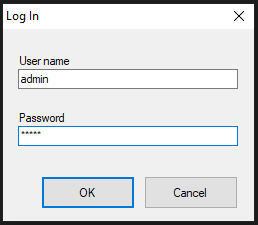
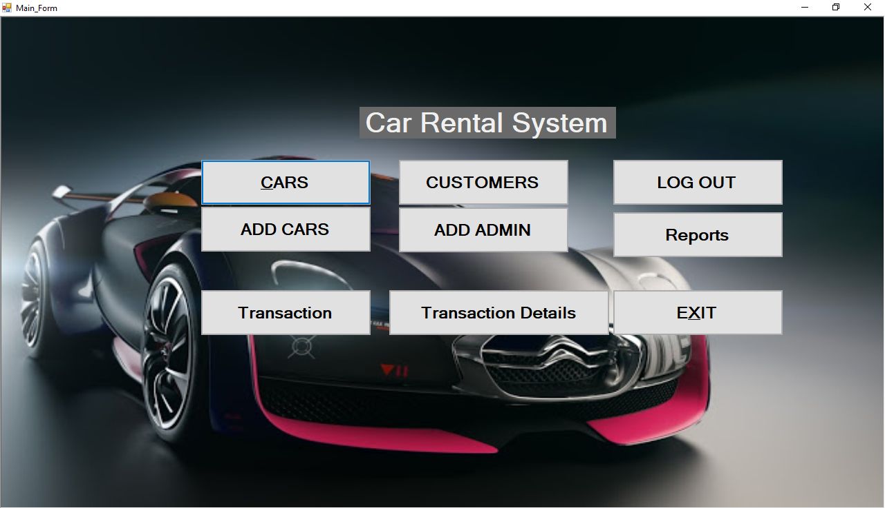
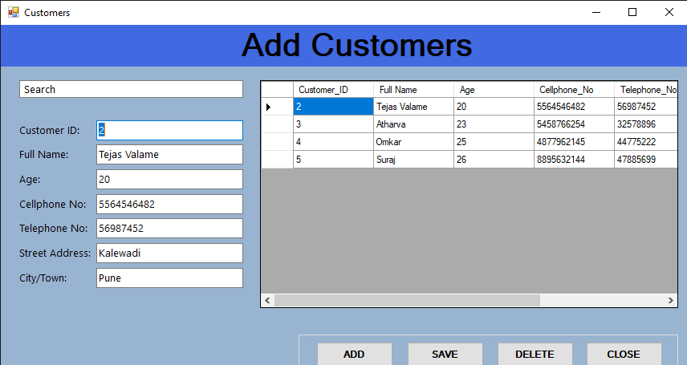
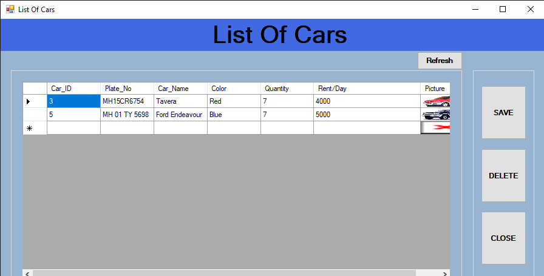
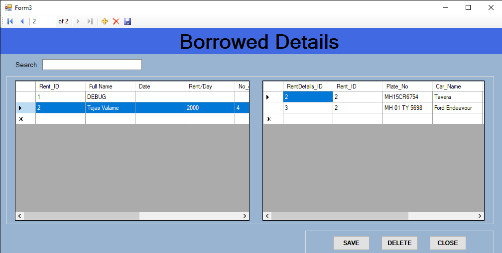

# 🚗 Car Rental System

A desktop-based application built using **VB.NET** and **Microsoft Access**, designed to automate the car rental process. This system streamlines customer booking, vehicle management, and billing, providing a simple yet efficient solution for rental businesses.

---

## 📋 Project Overview

This project was developed as part of the TYBBA-CA curriculum under Savitribai Phule Pune University. It aims to replace the manual car booking process with an automated system that improves accuracy, saves time, and simplifies operations.

---

## 🧰 Tech Stack

- **Frontend**: Visual Basic .NET (Windows Forms using Visual Studio 2008)
- **Backend**: Microsoft Access
- **Platform**: Desktop (Windows 7/8/XP)

---

## 🔧 Features

- Admin login authentication
- Customer registration
- Add/view/delete available cars
- Car booking and return management
- Automatic rent calculation and bill generation
- Transaction reports and record maintenance

---

## 💻 System Screenshots

### 🧑‍💼 Admin Login

### 🏠 Main Dashboard

### ➕ Add Customer

### 🚘 Add Cars

### 📋 Booking Cars

### 🧾 Rent Details / Billing

---

## ⚙️ System Requirements

### Hardware:
- Intel Pentium Dual CPU
- 2 GB RAM or more
- 30 GB Hard Disk

### Software:
- Windows 7 / 8 / XP
- Visual Studio 2008
- MS Access (Database)

---

## ✅ Advantages

- Easy to use with minimal technical knowledge
- Reduces manual errors and paperwork
- Quick report generation and data access
- Secure access for admin

## ⚠️ Limitations

- Offline-only system (no online bookings)
- Customer interaction requires admin mediation
- Limited scalability

---

## 🔮 Future Enhancements

- Upgrade to an online platform with customer login
- Add real-time car tracking with GPS
- Implement a backup mechanism and cloud-based storage
- Build a responsive UI for mobile/tablet support

---

## 📚 References

- [VB.NET Tutorial - TutorialsPoint](https://www.tutorialspoint.com/vb.net/index.htm)
- [System Analysis & Design](https://www.tutorialspoint.com/system_analysis_and_design/index.htm)
- *The Complete Reference Visual Basic .NET* – Jeffrey R. Shapiro  
- *Programming Microsoft Visual Basic .NET* – Francesco Balena

---

## 👨‍💻 Developed by

**Atharva N. Rao**  
**Tejas V. Valame**

📍 MIT Arts, Commerce & Science College, Alandi (D)  
🎓 Academic Year: 2020–21  
📩 [atharvarao3000@gmail.com](mailto:atharvarao3000@gmail.com)

